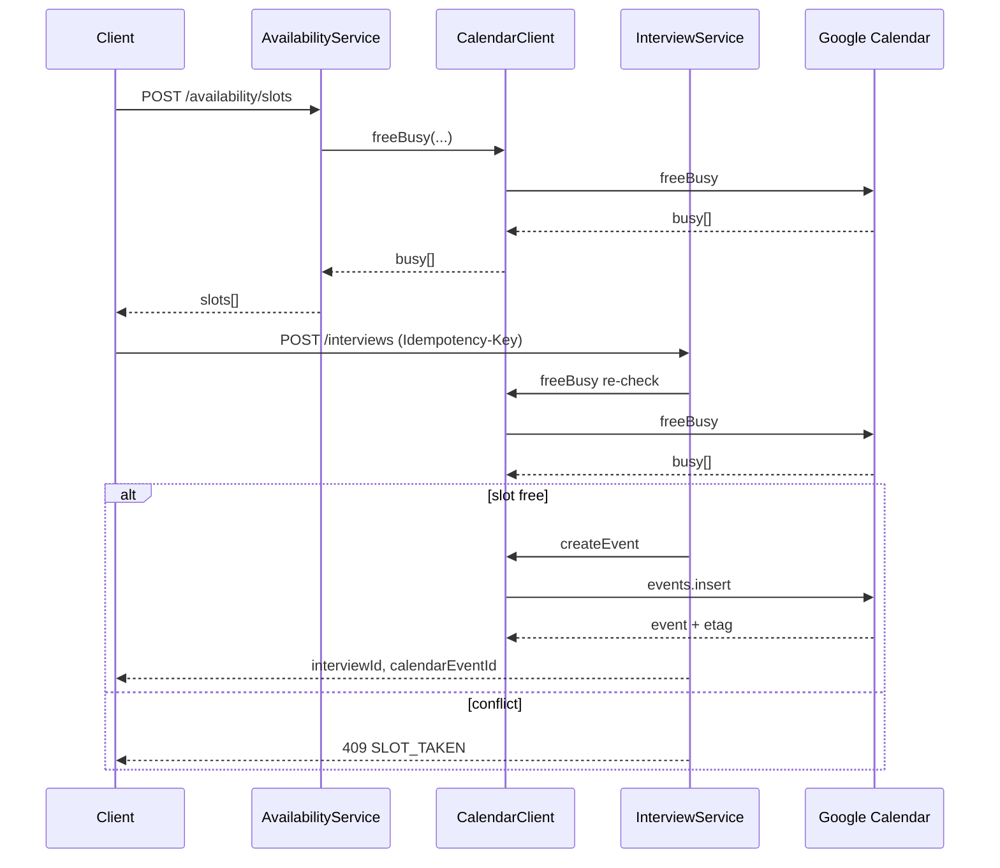

# ADR-0001: Google Calendar Integration Architecture & NFRs

- **Status:** Proposed
- **Date:** 2026-10-01
- **Owner:** Akhter (Solution Architect)
- **Ticket:** [#2](https://github.com/umar-id/Project-A/issues/2)
- **Epic:** [#1](https://github.com/umar-id/Project-A/issues/1)

## Context

Project-A schedules interviews against interviewer Google Calendars: OAuth, free/busy → slot calculation, book / reschedule / cancel, with audit. We need clear service boundaries, safe token storage, API contracts, failure modes, and SPOFs before Dev scaffolds (#3–#5) and QA locks vectors (#6).

## Decision

### 1. Service boundaries

| Component | Responsibility |
| --- | --- |
| `AuthService` | Google OAuth start/callback; session issuance |
| `TokenStore` | Encrypted refresh tokens; revoke/expiry metadata |
| `CalendarClient` | Typed Google Calendar API wrapper (list, freeBusy, events CRUD) with refresh + retry |
| `AvailabilityService` | Slot calc from busy intervals + working hours + duration + TZ |
| `InterviewService` | Book / reschedule / cancel; idempotency; audit records |
| `WebhookHandler` (phase 2) | Calendar push notifications / sync reconciliation |

App owns business state (`interviews`, `audit`); Google owns calendar truth. We never store access tokens long-term—only encrypted refresh tokens + short-lived access cache in memory/Redis with TTL.

### 2. OAuth & token storage

**Endpoints**
- `POST /oauth/google/start` → `{ redirectUrl }`
- `GET /oauth/google/callback?code=&state=` → stores refresh token; issues app session

**TokenStore schema**
- `user_id` (PK)
- `refresh_token_enc` (AES-GCM / KMS-backed key; never plaintext in repo/env/logs)
- `scopes` (string[])
- `expiry` (optional hint)
- `revoked_at` (nullable)
- `updated_at`

**Scopes (minimum)**
- `https://www.googleapis.com/auth/calendar.events`
- `https://www.googleapis.com/auth/calendar.readonly`  
  (tighten later if freeBusy + event CRUD can be covered with a single narrower scope set)

**Refresh policy:** `CalendarClient` refreshes access tokens transparently. On `invalid_grant` → mark `revoked_at`, force re-consent; callers get `401 REAUTH_REQUIRED`.

### 3. Calendar API usage

**Client surface (#3)**
- `listCalendars(userId)`
- `freeBusy(userId, calendarIds[], timeMin, timeMax)` → busy intervals
- `createEvent(userId, payload)` / `updateEvent` / `deleteEvent`
- Map Google `403 rateLimitExceeded` / `429` → retry with exponential backoff + jitter (max 3); then surface `503 CALENDAR_RATE_LIMITED`

**Availability (#4)**
- `POST /availability/slots`
```json
{
  "interviewerIds": ["u1"],
  "durationMin": 45,
  "window": { "start": "ISO-8601", "end": "ISO-8601" },
  "workingHours": { "start": "09:00", "end": "17:00", "days": [1,2,3,4,5] },
  "tz": "Asia/Karachi"
}
```
- Response: `{ "slots": [{ "start", "end" }] }` sorted, TZ-aware; unit-test DST edges

**Interviews (#5)**
- `POST /interviews` + header `Idempotency-Key` → `{ interviewId, calendarEventId }`
- `PATCH /interviews/:id` reschedule (idempotent on key)
- `DELETE /interviews/:id` cancel + Calendar delete
- Persist: `status`, `calendar_event_id`, `calendar_etag`, `created_by`, `updated_at`, `attendees`, `metadata`

### 4. Concurrency & double-book

Slot commit uses optimistic locking: re-check `freeBusy` (or etag) immediately before `createEvent`. On conflict → `409 SLOT_TAKEN` and return refreshed slots. Do not rely solely on Calendar; hold a short-lived reservation row (`slot_key`, `expires_at`) when multi-step UX needs it.

### 5. Webhooks / push (phase 2)

Initial MVP: read-on-demand freeBusy at request time. Phase 2: watch channels on interviewer calendars; `WebhookHandler` invalidates busy cache and reconciles external cancels. Until then, document lag SPOF (external edits between slot offer and book).

### 6. NFRs

| NFR | Target |
| --- | --- |
| Availability slot p95 | < 2s for ≤ 5 calendars, 14-day window |
| Book p95 | < 3s including Google round-trip |
| Secrets | No secrets in repo; KMS/env for envelope key only |
| Audit | Every mutate writes audit row (actor, action, before/after ids) |
| Idempotency | Book/reschedule safe under retry with same `Idempotency-Key` |
| Observability | Structured logs with `user_id`, `interview_id`, Google `requestId`; metrics for refresh failures, 403/429, conflicts |

### 7. SPOFs & mitigations

| SPOF | Mitigation |
| --- | --- |
| Google token revoke | Detect `invalid_grant`; UX re-consent; no silent fail |
| Calendar API outage / 5xx | Circuit breaker; queue optional; clear `503` |
| Rate limit 403/429 | Backoff + jitter; bulk freeBusy where possible |
| Double-book race | Optimistic re-check + `409`; optional reservation TTL |
| Webhook lag (MVP) | Accept; refresh freeBusy at book; phase-2 watches |
| KMS / token store down | Fail closed on OAuth and Calendar calls |

## Sequence (book happy path)



## Consequences

- **Pros:** Clear contracts for #3–#5; QA can lock #6 vectors; secrets out of repo; double-book and revoke paths explicit.
- **Cons:** MVP lacks push sync (eventual external drift); depends on Google quotas; KMS operational requirement.
- **Follow-ups:** Ali scaffolds #3 from these contracts; Zeeshan maps #6 negatives (revoke, 403, double-book); ADR approval unblocks implementation PRs.

## Approval

- [ ] SA (Akhter)
- [ ] PM (Adil)
- [ ] Dev ack (Ali) — contracts usable for #3
- [ ] QA ack (Zeeshan) — vectors aligned
